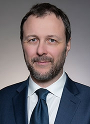
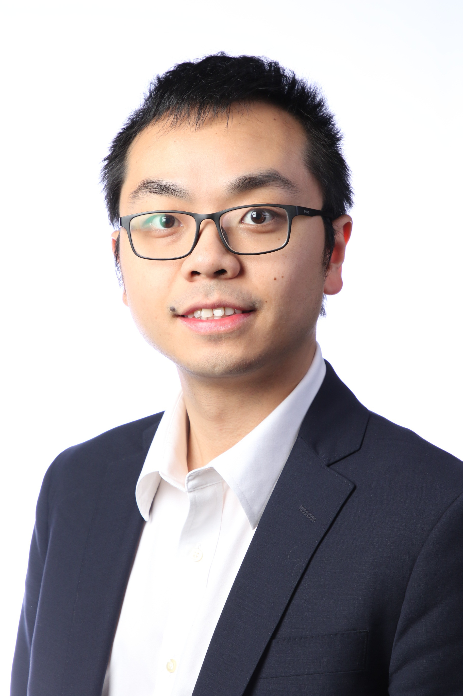
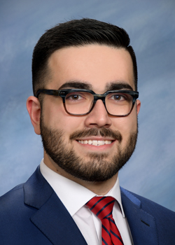
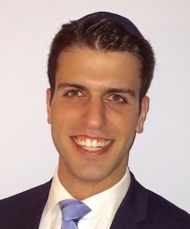
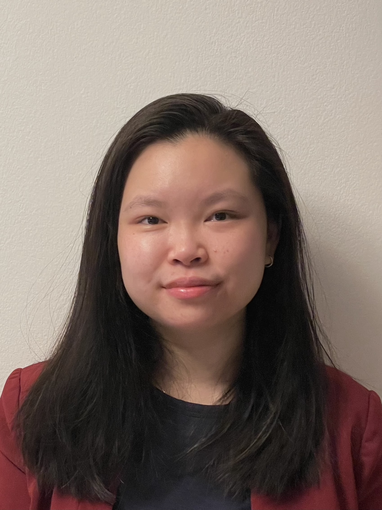
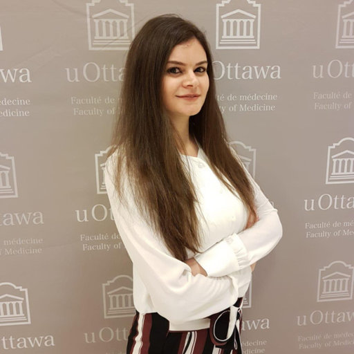
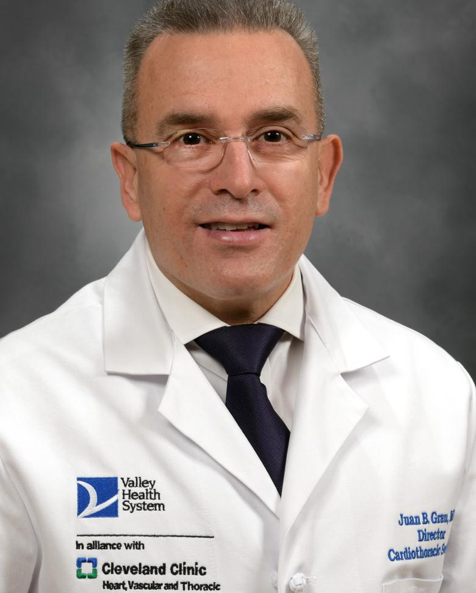

<head>
<link rel="stylesheet" href="https://cdnjs.cloudflare.com/ajax/libs/font-awesome/4.7.0/css/font-awesome.min.css">
<head>

<body>

\

# Principal Investigator 

\

{width=25%}

### *Giovanni Ferrari, PhD* 

First-generation graduate at the [U of Pavia](https://web-en.unipv.it) (2003), I am a group leader and Associate Professor (with tenure) at Columbia University, [Department of Surgery](https://columbiasurgery.org/research) and [School of Biomedical Engineering](https://www.bme.columbia.edu). \

I am the Scientific Director of the [Cardiothoracic Research Program and Director of the Columbia Biobank for Translational Science](https://columbiasurgery.org/research/ferrari-lab), an applied biobank supporting translational and precision medicine initiatives.\

My main research interests are in heart valve and vascular cell physiology, cardiac mechanobiology, materials science in medical devices, and the brain-heart axis.

<i class="fa fa-telegram"></i> [Email](mailto:<gf2375@cumc.columbia.edu>)

\

<a class="twitter-timeline" data-width="650" data-height="450" href="https://twitter.com/ferrag02?ref_src=twsrc%5Etfw">Tweets by ferrag02</a> 

\
	
#  Ferrari Lab Members 

\

<a id="ECastillero">

### Associate Research Scientists

\

{width=25%}

#### *Estibaliz Castillero, PhD*

I am a Biomedical Researcher with a PhD in Physiology and Endocrinology. My research focuses on the study of the advanced stages of myocardial and cardiac valve remodeling. My research argues that cardiac remodeling is regulated both at a local and systemic level and that it may, in turn, affect remote tissues by endocrine crosstalk. \

Currently, I am leading projects that explore myocardium-cardiac valve communication in the adaptation to ischemic injury and the role of circulating factors from the skeletal muscle in cardiac remodeling in end-stage heart failure. 

<i class="fa fa-telegram"></i> [Email](mailto:<ec2929@cumc.columbia.edu>)\
*(recommendations for mystery books welcome)*

<i class="fa fa-book"></i> [Google Scholar](https://scholar.google.com/citations?hl=en&user=02qHMNkAAAAJ)\

<i class="fa fa-twitter"></i> [Twitter](https://twitter.com/EstiCastillero)\

\

{width=25%}

#### *Chiara Camillo, PhD*

Dr. Camillo is a cellular biologist studying the molecular mechanisms that regulate endothelium and vascular morphogenesis. Broadly, her research focuses on translational and clinical approaches to studying cardiovascular diseases using both in vitro and in vivo models. Dr. Camillo is leading projects on thoracic aortic aneurysm development, focused on determining the impact of glycation products on cellular phenotype, extracellular matrix remodeling and aortic wall instability. 

“Sciences provide an understanding of a universal experience, Arts are a universal understanding of a personal experience... they are both a part of us and a manifestation of the same thing... the arts and sciences are avatars of human creativity” -- Mae Jemison\

<i class="fa fa-telegram"></i> [Email](mailto:<cc4418@cumc.columbia.edu>)\

<i class="fa fa-book"></i> [ORCID](https://orcid.org/0000-0001-8000-3188)\

---

### Postdoctoral Research Fellows	

\

{width=25%}

#### *Yingfei Xue, PhD*\

Dr. Yingfei Xue is currently a postdoctoral research scientist in Dr. Giovanni Ferrari lab at Columbia University. He obtained his PhD degree from [University of Pittsburgh School of Pharmacy](http://www.pharmacy.pitt.edu/research/research_index.php). His research interest is centered around cardiovascular implants including bioprosthetic valves, conduits, and patches. \

His research goal is to better understand the mechanisms of cardiovascular implant failure and improve implant durability. He has 20 publications and served as editorial board member and reviewer for multiple journals in the fields of biomedical engineering.

<i class="fa fa-telegram"></i>  [Email](mailto:<yx2529@cumc.columbia.edu>)\

<i class="fa fa-book"></i>  [Google Scholar](https://scholar.google.com/citations?user=W8-jXZ0AAAAJ&hl=en)

\

---

### Surgical Residents

{width=25%}

#### *Erfan Faridmoayer, MD*

Erfan is a General Surgery resident undertaking a T32-funded postdoctoral fellowship at the Ferrari Lab, while pursuing a Master of Science in Biostatistics with the [Columbia University Mailman School of Public Health](https://www.publichealth.columbia.edu/academics/degrees/master-science/clinical-research-methods). Prior to joining the lab, Erfan obtained his Bachelor of Science with Honors in Molecular, Cell, and Developmental Biology at [UCLA](https://www.mcdb.ucla.edu). He then attended medical school at [Oakland University William Beaumont School of Medicine](https://oakland.edu/medicine) in Michigan, where he developed his passion for a career in academic surgery. He has since pursued his surgical training at [SUNY Downstate](https://www.downstate.edu/education-training/fellowship-residency-programs/surgery/index.html). Erfan’s research interests include investigating molecular drivers valve degeneration and cardiac tissue engineering, and cardiac surgical outcomes. In his spare time, Erfan enjoys kayaking, hiking, and exploring the New York food scene.

<i class="fa fa-telegram"></i> [Email](mailto:<ef2721@cumc.columbia.edu>)

<i class="fa fa-twitter"></i> [Twitter](https://twitter.com/erfanfarid)

\

{width=25%}

#### *Sameer Singh, MD*

Sameer is a resident in the Integrated Cardiothoracic Surgery Program at Columbia University. He has completed three years of surgical residency and has clinical interests in heart failure, transplantation, and mechanical circulatory support. He obtained his MD from [Northwestern University](https://www.https://www.feinberg.northwestern.edu) in Chicago, IL. Currently, with the support of the Thoracic Surgery Foundation (TSF) Resident Research Fellowship Award, he is studying the underlying mechanisms of structural valve degeneration specifically with regards to transcatheter valve technologies. 

<i class="fa fa-telegram"></i> [Email](mailto:<ss5685@cumc.columbia.edu>)

\

---

### Graduate Students

\
 
{width=25%}

#### *Dov Levine, MD*

Dov is a General Surgery resident and aspiring Cardiac Surgeon currently pursuing a PhD in Cellular, Molecular, and Biomedical Studies with the Ferrari Lab. A local New Yorker, he attended medical school at [Albert Einstein College of Medicine](https://einsteinmed.org), and graduated with Alpha Omega Alpha and Distinction in Clinical Research honors. He then continued with his surgical training at [Robert Wood Johnson University Hospital](https://www.rwjms.rutgers.edu/departments/surgery/divisions/other/division-of-general-surgery/residency/about-the-program). His research interests include cellular mechanisms of thoracic aortic aneurysm development, including the role of Advanced Glycated End products (AGEs) on aortic wall instability.

<i class="fa fa-telegram"></i> [Email](mailto:<dl3267@cumc.columbia.edu>)

\

---

### Medical Students

{width=25%}

#### *Evan Woodard* \
*Morehouse School of Medicine*

Evan is a second-year medical student at [Morehouse School of Medicine](https://msm.edu) interested in a career in cardiothoracic surgery. Some of his research and clinical interests include patient outcomes research and minimally invasive surgical techniques. 

\

---

### Chief Vision Officer 

{width=25%}

#### *Churro*

2 years old Irish-Doodle. Strong interest in any type of food.
Life's not ruff when I am around. Woof

\

---

### Alumni\

\

{width=25%}

#### *Edoardo Bianco (2022)* \
*U of Bologna*\

Edoardo is a medical student in his  fifth year at the [Alma Mater Studiorum Università di Bologna](https://www.unibo.it/en). He developed an interest for cardiac surgery during his third year in medical school. His research and clinical interests involve the study of the aortic pathology, particularly the treatment of acute aortic syndrome and the sub-cellular mechanisms involved in its pathogenesis.  

\

{width=25%}

#### *Mangesh Kurade, MS (2019-2022)*

Mangesh was the lab manager for Ferrari Lab. He completed his Masters of Science in Pharmacology and Toxicology from Long Island University in Brooklyn, New York. His research background involved basic molecular and translational biology in cardiovascular, inflammation and infectious diseases. In his free time, he enjoys playing tennis, his guitar and taking long drives.

<i class="fa fa-telegram"></i> [Email](mailto:<mk4376@cumc.columbia.edu>)

\

{width=25%}
 
#### *Nicolò Vitale, MD (2021-2022)*\
*U of Milan*

Nicolò Vitale is cardiac surgery resident at [Università degli studi di Milano](https://www.unimi.it/it). He obtained his MD from Università degli studi di Milano. He is very interested in the mechanisms of ischemic heart failure. He studied the mechanisms of structural degeneration of the pediatric bioprosthetic conduits.

\

{width=25%}

#### *Alexey Abramov, MD, MS (2020-2022)*

Alexey is a General Surgery resident in the [New York Presbyterian-Columbia](https://columbiasurgery.org/general-surgery-residency) program with an interest in cardiothoracic surgery fellowship and biomedical engineering.  He graduated from [Emory University](http://college.emory.edu/main/index.html) and received his MD from [New York Medical College](https://www.nymc.edu/school-of-medicine-som/). He completed an NIH T32 post-doctoral research fellowship in Dr. Ferrari's lab studying the underlying mechanisms of structural degeneration of bioprosthetic heart valves with next-generation proteomics. While in the lab, he also completed a Master's degree in Biostatistics at the [Columbia University Mailman School of Public Health](https://www.publichealth.columbia.edu/academics/degrees/master-science/clinical-research-methods). In his free time, he enjoys the outdoors, hiking, running, road cycling and skiing.

<i class="fa fa-telegram"></i> [Email](mailto:<aa3832@cumc.columbia.edu>)

<i class="fa fa-twitter"></i> [Twitter](https://twitter.com/aabramov_MD)

\

{width=25%}

#### *Vivian Moreno (2020-2022)*

Vivian Moreno was the Clinical Research Coordinator for the Ferrari Lab. She completed her Bachelor’s of Science in Biomedical Science at the [University of Kent in Canterbury, England](https://www.kent.ac.uk). Her research background included cancer research at Yale University and novel antimicrobial peptides at [NovaBiotics, Ltd](https://novabiotics.co.uk). She is now pursuing advanced training in Hofstra Cardiovascular Medicine and Perfusion program. 

<i class="fa fa-telegram"></i> [Email](mailto:<vmm2142@cumc.columbia.edu>)

\

{width=25%}

#### *Jessica Tom (2020-2022)*

Jessica was a Research Technician in the Ferrari Lab. A native New Yorker, she completed her Bachelor’s of Science in Biology and Women’s Gender and Sexuality Studies at [Stony Brook University](https://www.stonybrook.edu). While at Stony Brook, she conducted research pertaining to Chronic Myelogenous Leukemia (CML) in the lab of Dr. Markus Seeliger. Her interest in cardiovascular diseases and prevention led her to the Ferrari Lab where she provided support to the Biobank and various research projects. She is now a medical student at Albert Einstein College of Medicine.

<i class="fa fa-telegram"></i> [Email](mailto:<jessica.tom@alumni.stonybrook.edu>)

\

{width=25%}

#### *Clinton Erwin, MD (2021-2022)*

Clinton is a resident in  [Integrated Cardiothoracic surgery at New York Presbyterian-Columbia](https://columbiasurgery.org/cardiothoracic-training). He obtained his MD from [University of Alabama at Birmingham](https://www.uabmedicine.org), where he developed an interest in cardiac surgery. While in lab, he studied mechanisms of cardiovascular damage related to COVID-19, along with several clinical projects in adult cardiac surgery.   

<i class="fa fa-telegram"></i> [Email](mailto:<we2153@cumc.columbia.edu>)

\

#### *Michael Simpson, MD (2021-2022)*

Michael is a resident in the [Integrated Cardiothoracic surgery at New York Presbyterian-Columbia](https://columbiasurgery.org/cardiothoracic-training). He obtained his MD from [Columbia University College of Physicians & Surgeons](https://www.vagelos.columbia.edu/education/academic-programs/md-program). While in the lab, he studied pathologic mechanisms in mitral valve disease and was involved in several clinical projects across the spectrum of adult cardiac surgery.

<i class="fa fa-telegram"></i> [Email](mailto:<mts2153@cumc.columbia.edu>)

\

{width=25%}

#### *Mar Martinez Mas, MBE (2020-2022)*
*Columbia University*\

Mar Martinez Mas was a Master’s student in [Biomedical Engineering at Columbia University](https://www.bme.columbia.edu). She is from Barcelona, Spain, and completed her undergraduate degree at [Universitat Pompeu Fabra](https://www.upf.edu/es/) (Barcelona, Spain) where she worked in the field of biomedical electronics. Afterward, she completed the last year and a half of her degree at the [Politecnico di Milano](https://www.polimi.it) (Milan, Italy), where she mainly studied the field of biomechanics.\
Her main interest lies in prosthetic heart valves and life support systems. She joined the Ferrari Lab in 2021 and studied the mass and tissue thickening of cardiac valvular bioprostheses under different conditions. She has since joined the industry to advance her research development.

<i class="fa fa-telegram"></i> [Email](mailto:<mm5944@columbia.edu>)

\

#### Antonio Frasca, PhD \
T-32 Postdoctoral Research Fellow	(2016-2021)\

\

#### Alex P Kossar, MD	\

General Surgery Resident	(2018-2020)\

\

#### Alex D’Angelo, MD	\
Integrated Cardiothoracic (I-6) Surgery Resident		(2019-2020)\

\

#### Matteo Marro, MD	\
General Surgery Resident	(2019-2020) \

\

---

#  Collaborators 

{width=25%}

### Robert J. Levy, MD\
Director of Cardiology Research\
Program Director of the Cardiology National Heart, Lung, and Blood Institute (NHLBI) Research Training Grant\

*Children's Hospital of Philadelphia*\

\

Levy is the director of Cardiology Research, and also serves as program director of the Cardiology [National Heart, Lung, and Blood Institute (NHLBI)](http://www.nhlbi.nih.gov) Research Training Grant. 

His research interests are the pathophysiology of biomaterials used in medicine, basic mechanisms and novel therapies for heart valve disease, arterial angioplasty, local drug delivery, and nanomedicine. He also has experience over three decades in medical device development.\

*R01HL131872*

\

{width=25%}

### David Kalfa, MD, PhD\

Florence Irving Associate Professor of Surgery\
Section of Pediatric & Congenital Cardiac Surgery\
Director, Pediatric Heart Valve Center\
Surgical Director, Initiative for Pediatric Cardiac Innovation\
*Columbia University College of Physicians and Surgeons*\

\

 Expandable Polymeric-valved Conduit to Repair Congenital Heart Disease 

The proposed research is relevant to public health because a biostable polymeric valved conduit that can be implanted surgically to reconstruct the right ventricular outflow tract in neonates and infants and then expanded by successive transcatheter procedures to reach the adult size, would revolutionize how we treat children with heart valve diseases. Such a new generation of valved conduit would decrease the number of open-heart surgeries and reoperations, decrease the mortality, complications and healthcare costs related to these procedures and increase the life expectancy and quality of life of these patients.\

*R01HL155381*

\

{width=25%}

### Micheal S Sacks, PhD\

*University of Texas at Austin*

\

The bicuspid aortic valve (BAV) is the most common cardiac congenital anomaly. Due to the widespread availability and routine use of screening echocardiography, development of clinical methods for the identification of asymptomatic young patients with BAV is now realistic. We thus plan to develop sensitive, clinically derivable functional indices that will yield clinically relevant patient- specific strategies for identifying BAV patients at high risk.\

*R01HL142504*

\

[Lab Website](https://wccms.oden.utexas.edu)

\

{width=25%}

### Lara Garibeh, PhD\

*University of Ottawa Heart Institute*

*Canadian Institute of Research and Health (CIHR) Fellowship (2021-2023)*\

\

Identification of Molecular Pathways that Protect Against Atherosclerosis
Coronary artery disease (CAD) is one of the leading causes of cardiovascular death worldwide. Current treatments for CAD include lifestyle modifications and medical therapies to reduce its risk factors. When these methods fail, more invasive interventions, such as placement of a stent to restore blood flow or performance of a coronary artery bypass graft surgery, are used. This latter procedure aims at bypassing the blocked area using either veins or arteries. The use of arterial grafts is associated with a better long-term patency and a reduced rate of progression of atherosclerosis when compared to vein grafts. Yet, the exact molecular mechanisms by which arteries are protected from disease progression are not well understood. This study aims to identify the underlying mechanisms that render arteries resistant to atherosclerosis.\

[LinkedIn](https://www.linkedin.com/in/lara-gharibeh/)

\

{width=25%}

### Juan B Grau, MD\

Director, Cardiac Surgery\
*The Valley Hospital *\

\

Dr. Grau's work blends clinical knowledge and expertise with the tools of basic science to find new approaches to clinically relevant problems. He serves as a reviewer for the Annals of Thoracic Surgery, Journal of the American Heart Association, Circulation, and the British Heart Foundation, among others.\

\

{width=25%}

### Walter R. Witschey, PhD\
Associate Professor of Radiology\
Director of the Advanced Cardiovascular Imaging Lab at the University of Pennsylvania\
*University of Pennsylvania*\

\

Theoretical and applied advanced imaging, especially magnetic resonance imaging and quantitative cardiovascular imaging.

[Lab Website](https://www.med.upenn.edu/corlab/)

\

\

</body>

&nbsp;

Created by Alexey Abramov MD</a>

<em>aa3832@cumc.columbia.edu</em>

<!-- Add font awesome icons -->

    
    
    

&copy; Copyright 2022, Ferrari Lab at Columbia University</a>

&nbsp;

