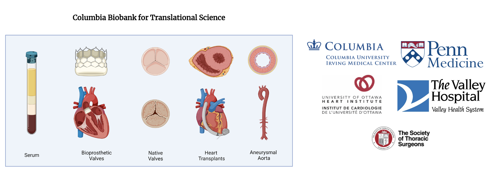

\

<body>

# Introduction
\

The Columbia Biobank for Translational Science – CBTS is an applied biobank supporting translational and precision medicine initiatives for adult and pediatric cardiothoracic research.\

{width=85%}

Established in 2017 it included specimens collected from patients undergoing cardiothoracic surgery at CUIMC and CHONY. Frozen and paraffin tissues, primary-derived cells, RNA, DNA, serum, plasma as well as clinical and imaging data are collected by our clinical coordinators upon informed consent.  CBTS shares clinical data with partner biobanks at the University of Pennsylvania, University of Texas, University of Ottawa, Valley Hospital, and a quickly expanding list of national and international research partners./

Our Biobank strongly collaborate with the [Columbia University Biobank and The Irving Institute for Clinical and Translational Research](https://www.irvinginstitute.columbia.edu).

\

---

#	Inquiries

\

Please contact Dr. Ferrari and/or our Biobank Clinical Research Coordinator Vivian Moreno for more information regarding requesting available specimens for your research.  

<i class="fa fa-telegram"></i> [Email Dr. Ferrari](mailto:<gf2375@cumc.columbia.edu>)

<i class="fa fa-telegram"></i> [Email Vivian Moreno](mailto:<vmm2142@cumc.columbia.edu>)

\

\

\

\

&nbsp;

Created by Alexey Abramov MD</a>

<em>aa3832@cumc.columbia.edu</em>

<!-- Add font awesome icons -->

    
    
    

&copy; Copyright 2021, Ferrari Lab at Columbia University</a>

&nbsp;

