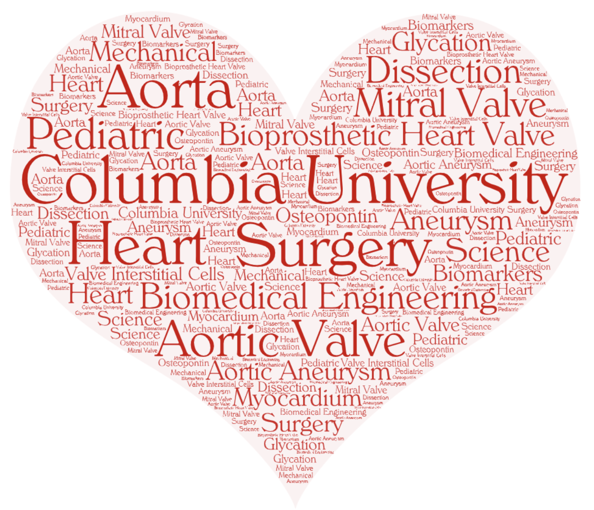

<head>
<link rel="stylesheet" href="https://cdnjs.cloudflare.com/ajax/libs/font-awesome/4.7.0/css/font-awesome.min.css">
</head>

<body>

\

## <i class='fas fa-compass'></i> Our Lab

\

**Welcome to the Ferrari Laboratory website.**  \

**We are located at the Columbia University Irving Medical Center in New York City, New York.**

\

{width=80%}

\

## <i class='fas fa-flask'></i> Our Research\

\

{width=65%}

\

## <i class='fas fa-rss-square'></i> Lab News

\

December 2021\
[Yingfei Xue's PhD](about.html#PostDocs) manuscript <i class="fas fa-file-alt"></i> "Age-related enhanced degeneration of bioprosthetic valves due to leaflet calcification, tissue crosslinking, and structural changes" was accepted for publication in [Cardiovascular Research](https://academic.oup.com/cardiovascres).

\

December 2021\
Launched Ferrari Lab website! <i class='fas fa-wifi'></i>

\

November 2021\
[Estibaliz Castillero PhD](about.html#Scientists) presented <i class="fas fa-microphone-alt"></i> her research on [Serotonin Transporter Deficiency Leads to a Specific Fibrotic Pattern in Valvular and Myocardial Tissue](https://www.ahajournals.org/doi/10.1161/ATVBAHA.121.316111) at the [American Heart Association](https://professional.heart.org/en/meetings/scientific-sessions) annual meeting.

\

October 2021\
[Alexey Abramov MD](about.html#SurgRes) was invited to present <i class="fas fa-microphone-alt"></i>
"Extracorporeal Membrane Oxygenation (ECMO) Support in Patients with Covid-19: A Historical Control Propensity Score Matched Study" at the annual meeting of the [Society of Thoracic Surgeons](https://www.sts.org/meetings/calendar-of-events/sts-58th-annual-meeting).  

\

## <i class='fas fa-comments'></i> Social Media

<a class="twitter-timeline" data-width="650" data-height="350" href="https://twitter.com/lab_ferrari?ref_src=twsrc%5Etfw">Tweets by lab_ferrari</a> 

\

## <i class='fas fa-camera'></i> Photos 

Coming soon

\

##  <i class='fas fa-bookmark'></i> Navigate

\

### Ferrari Lab Links

\

<i class='fas fa-users'></i> [About Us](about.html)\
Meet our team and collaborators

<i class='fas fa-flask'></i> [Projects and Publications](projects.html)\
Explore our ongoing projects and publications 

<i class='fas fa-vial'></i> [Cardiothoracic Biobank Inquiries](biobank.html)\
Information about our collected biobank specimens

<i class='fas fa-cubes'></i> [Research Program for Residents](program.html)\
Learn about our program for surgical residents interested in a career in translational science

\

### Columbia University Links

\

<i class='fas fa-laptop'></i> [Ferrari Lab – Columbia Biobank for Translational Science](https://columbiasurgery.org/research/ferrari-lab)\
Columbia University Ferrari lab website

---

<i class='fas fa-hospital-symbol'></i> [Columbia Cardiac Surgery](https://columbiasurgery.org/heart)\
Meet the surgeons from the Columbia Cardiac Surgery team

<i class='fas fa-stethoscope'></i> [Columbia Integrated Cardiothoracic Surgery Residency Program (I-6)](https://columbiasurgery.org/cardiothoracic-training)\
Learn about the Columbia Integrated Cardiothoracic Surgery residency program

---

<i class="fa fa-hospital-o" aria-hidden="true"></i> [Columbia General Surgery](https://columbiasurgery.org/)\
Meet the surgeons from the Columbia General Surgery team

<i class='fas fa-procedures'></i> [Columbia Surgery Residency Program](https://columbiasurgery.org/general-surgery-residency)\
Learn about the Columbia General Surgery residency program

\

</body>

\

\

\

\

&nbsp;

Created by Alexey Abramov MD</a>

<em>aa3832@cumc.columbia.edu</em>

<!-- Add font awesome icons -->

    
    
    

&copy; Copyright 2021, Ferrari Lab at Columbia University</a>

&nbsp;

