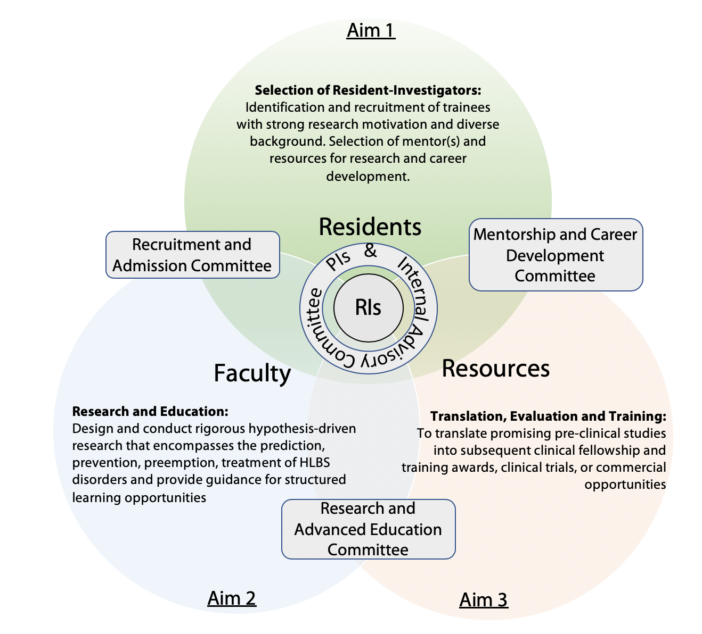

\

# Research Program for Residents

\

## Information

We are offering a training strategy and research mentoring plan for MD-Resident-Investigators at Columbia University Irving Medical Center (CUIMC), whose major interest is the treatment and prevention of heart, lung, and blood diseases, and their related co-morbidities, such as diabetes, atherosclerosis, immunodeficiencies, and environmental hazards. There is a known great need for intense residency training and research mentoring for young academic physician-scientists of the future. 

The rapid evolution of innovation in cardiothoracic, blood, and sleep diseases, based on contributions from various fields of basic and translational science, is adding new challenges for researchers who will form the next generation of academic physicians. Critical new scientific knowledge and techniques offer greater challenges to the life of future clinicians and require their understanding and use of advanced educational tools in order for them to better predict, prevent, preempt, treat, and cure these diseases.  Thus we developed our program around three major goals:

1.  To identify, recruit and foster research trainees of clinician-investigators with strong clinical, research motivation, and diverse background to perform basic, clinical and/or translational research\

2. To design and conduct rigorous hypothesis-driven research that encompasses the prediction, prevention, preemption, treatment of cardiothoracic disorders and provide guidance for structured learning opportunities\

3.  To translate effective pre-clinical studies into subsequent clinical fellowships and training awards, clinical trials, or commercial opportunities

\

{width=85%}

\

---

\

## Training Grants

The Department of Surgery promotes an enrichment program for residents to pursue research. Such a program varies in length, from a few months (supported by internal and extramural resources provided by the Division of Surgical Science) to multiple years (via the co-PI’s NIH-NHLBI T32 training grant and other federal training grants). 

Residents are introduced to the Research Opportunities by the Residency program directors and by the leaders of the Research Centers of the Division of Surgical Science. During PGY2 and PGY3 they interact with several mentors, choose a track (Basic, Translational, or Outcomes) and prepare a research proposal which is evaluated by the Department of Surgery Research Committee.

\

---

\

## Application Process

<u>**August - September**</u>: Applicants are invited to contact the PI via email and submit a full CV, a 1-page Research Statement, and the names of two references\

<u>**October - November**</u>: Interviews with Dr. Ferrari and the Leadership of the Dept of Surgery. Identification of possible clinical co-mentor(s) and research project(s).\

<u>**February - March**</u>: Selection of trainees and visit to Columbia. Meeting with PI, co-investigators, clinical co-mentor(s), and visit to the Lab\

<u>**Mid-June**</u>: Applicants are invited to attend the annual DOS Research Symposium. Each year, in June, each Resident-Investigator will attend a retreat with senior faculty members on this program sponsored by the Department of Surgery at the Roy and Diana Vagelos Education Center. A keynote lecture from an internationally recognized speaker will open the Symposium. 
A specific section will be dedicated to the Resident-Investigators who will present their research. The retreat is also a powerful networking opportunity for resident-investigator to learn and interact with senior academic physicians. The Research and Advanced Education Committee will provide feedback to the Resident-Investigators./

<u>**July 1st**</u>: PGY lab year(s) begins\

\

---

\

## John Jones Surgical Society

[*John Jones Surgical Society*](https://columbiasurgery.org/alumni/john-jones-surgical-society)

The John Jones Surgical Society. The Society is an organization named after the author of the first surgical textbook in the colonies and our first Professor of Surgery.  At its annual meetings The Society recognizes with awards outstanding residents with major accomplishments in research, surgical education, and in clinical service.  

In 2006 the John Jones Surgical Society established the John Jones Fellowship Fund within the Department of Surgery at Columbia University to generate support for young surgeon-researchers and surgeon-educators through a formal process. The Society's goal is to support basic and clinical research initiatives at the resident level. The fund currently supports the research activities of one General Surgery resident annually, selected on a competitive basis. A Research Committee composed of 22 faculty members from the Department of Surgery and external scholars review grant submissions as part of the Department of Surgery's Annual Startup Grant process which provides laboratory support awards. 

\

\

\

\

*Website built by A Abramov, Oct 2021*

