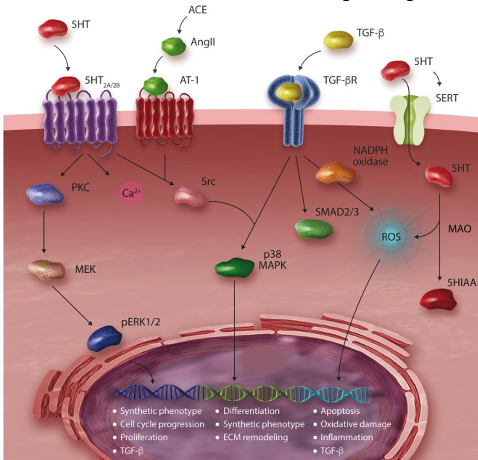
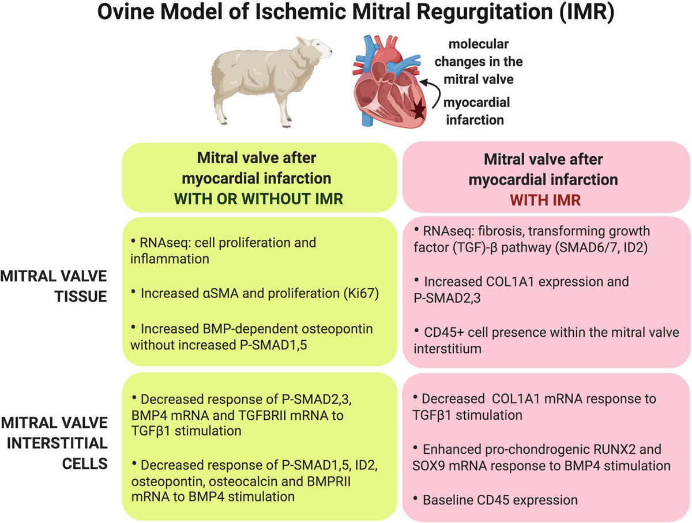
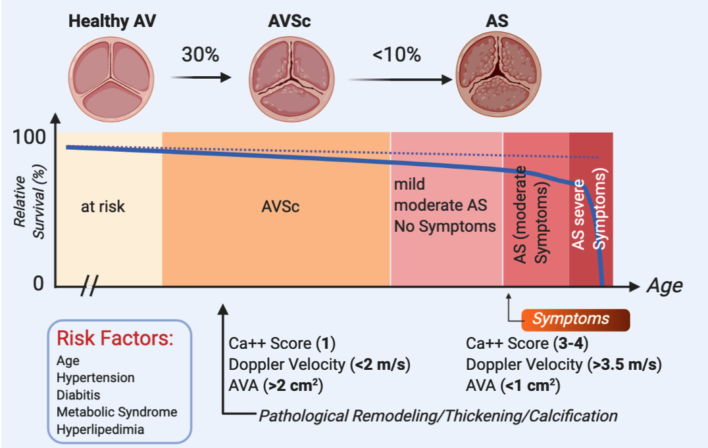
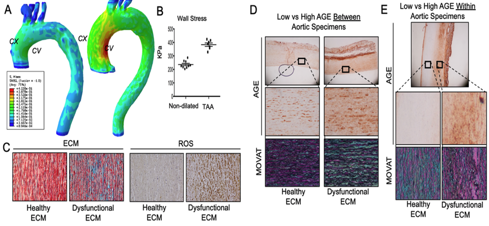
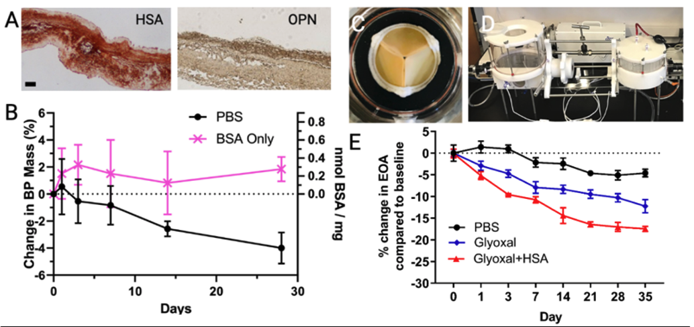
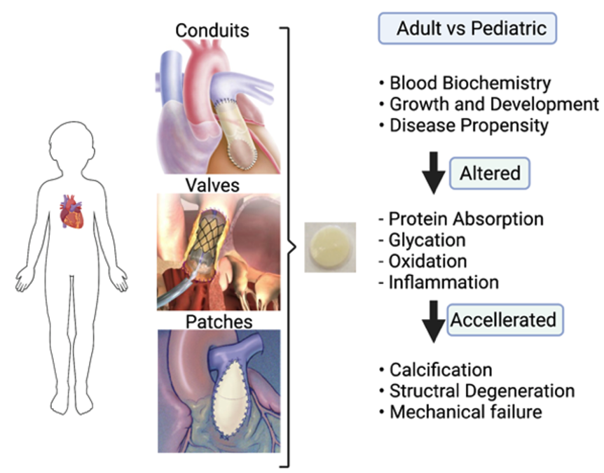
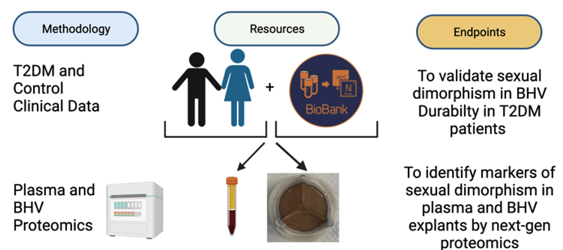
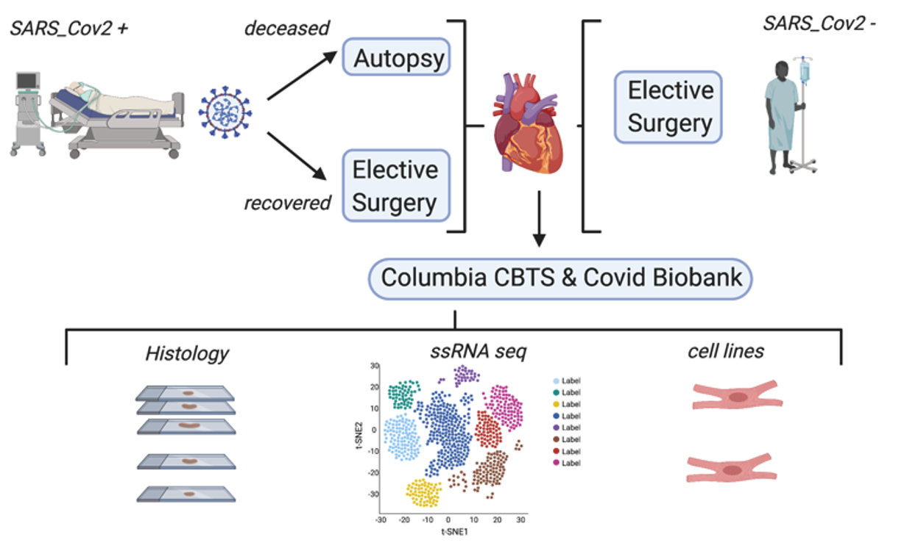

<head>
<link rel="stylesheet" href="https://cdnjs.cloudflare.com/ajax/libs/font-awesome/4.7.0/css/font-awesome.min.css">
</head>

\

# Mitral Valve \

## Myxomatous Mitral Valve Disease

Degenerative mitral regurgitation (MR) due to myxomatous valve disease affects millions. The only treatment is either valve repair or replacement. This project will advance understanding of the role of the neurotransmitter, serotonin (5HT) in MR. Heart valve disease has been associated with both 5HT-secreting carcinoid tumors and medications, such as the diet drug, Dexfenfluoramine. We will investigate the hypothesis that 5HT-mechanisms involving the serotonin transporter (SERT), and 5HT receptor (HTR) signaling, both in platelets and mitral valve interstitial cells (MVIC) of bone marrow origin, contribute to the pathophysiology MR, and represent promising therapeutic targets. It is expected that the mechanistic results of these studies will lead to therapeutic directions for MR that target platelet-derived 5HT and leverage a personalized approach using BOEC to model the pathophysiology.

\

{width=75%}

\

\
<body>

*Funding Source*\
*NIH R01HL131872 (Ferrari G - Levy RJ)*\
<i class='fas fa-flask'></i> [NIH Reporter](https://reporter.nih.gov/search/ZaoPhLvNK0GqfjFCGu3xvw/project-details/10130913)

\

## Ischemic Mitral Regurgitation\

Ischemic mitral regurgitation (IMR) often develops after an ischemic event, which results in distortion of the valvulo-ventricular complex and incomplete mitral valve (MV) leaflet coaptation. After left ventricular ischemic events, only some patients develop IMR. The susceptibility of the MV to remodel may influence whether IMR develops. We hypothesized that impaired signaling response in MV cells may contribute to IMR development by inducing maladaptive tissue remodeling.

\

{width=75%}

\

\

---

\

# Aortic Valve\

## Calcific Aortic Valve Disease\

This program is concerned with modulating oxidative glycation reactions in specimens from patients with variable degrees of Calcific Aortic Valve Disease (CAVD), a disease which, despite decades of investigation, remains without effective medical therapy. CAVD defines a spectrum of disorders from initial asymptomatic remodeling (aortic valve sclerosis; AVSc) to outflow obstruction (Aortic Stenosis, AS) that result in heart failure and death if not treated surgically. Over 30% of patients over 65 years of age have some degree AVSc and close to 10% of those develop severe symptomatic AS within a decade from diagnosis. Once AVSc is detected, there is an increased risk of adverse cardiovascular events. At the onset of mild symptoms (early AS), survival is further reduced, with a dramatic decline in patients with severe symptomatic AS. Thus, understanding the development of AVSc and its progression into AS is of high clinical significance for a very large cohort of patients. CAVD defines a spectrum of diseases from initial structural remodeling to outflow obstruction that could result in heart failure, and death. We discovered that glyco-oxidation moieties impact the AV via two pathological mechanisms: First, they modify the ECM via cross-linking of collagen/elastin and permanent incorporation of glycated circulating proteins. Second, they activate VICs towards the osteogenic phenotype: AGE binds RAGE which, via NADPH, generates ROS. AGEs and ROS mediate the DNA damage response that controls VIC phenotype. Both mechanisms lead to stiffening, mass increase, and calcification. 

\

{width=75%}

\

\

---

\

# Aorta\

## Aortic Aneurysm and Dissection\

Bicuspid Aortic Valve (BAV) syndrome is associated with frequent and premature occurrence of calcific aortic stenosis (AS) and thoracic aortic aneurysms (TAA), with 30-50% of BAV patients requiring surgery in their lifetime for AS, TAA, or both. It is estimated that 1.4% of the population is born with a BAV, making it the most common congenital heart defect in the US.  Eccentric flow dynamics, endothelial dysfunction, and genetic predisposition are key elements impacting the susceptibility of BAV patients to adverse aortic events. Dissection and rupture are mechanical failures of the aortic wall that occurs when the tensile limit of the aortic tissue is overwhelmed. To prevent these events, the ascending aorta is preventively replaced in high-risk patients. The major clinical obstacles hampering the decisions of whether replace the ascending aorta of BAV patients are the absence, in the current guidelines, of any tools informing on the structural integrity of the aortic wall independently of metric measurements and of any non-invasive risk-assessment tools. Here we tested the mechanistic hypothesis that mitigation of glycoxidation reactions revert AGE-mediated paracellular endothelial hyperpermeability and reduce the accumulation of glycol-oxidation products in the ascending aorta of BAV patients.  

\

{width=75%}

\

\

*Funding Source*\
*R01 HL122805*\
<i class='fas fa-flask'></i> [NIH Reporter](https://reporter.nih.gov/search/ZaoPhLvNK0GqfjFCGu3xvw/project-details/9762185)

\

---

\

# Biomedical Engineering

## Glycation-mediated Mechanisms of Bioprosthetic Heart Valve Failure\

Heart valve disease at this time can only be treated surgically, with either valve replacement or repair.  Bioprosthetic heart valves (BHV), fabricated from glutaraldehyde fixed heterografts, such as bovine pericardium (BP) or porcine aortic valves (PAV), are widely used in both cardiac surgery and in transcatheter valve replacements. Despite outstanding short-term outcomes, BHV dysfunction due to structural valve leaflet degeneration (SVD) develops over time, frequently necessitating device replacement. Calcification is observed in the majority of SVD cases; however, 25% or more SVD cases are not associated with calcification. Recent work from our group demonstrated that BHV are susceptible to non-calcification induced failure mechanisms, involving the formation of unique oxidized amino acids (OxAA) in BHV, such as the crosslink, di-tyrosine (di-Tyr). Feasibility studies also recently documented in BHV explant samples the presence of advanced glycation end products (AGE). The contributions of both AGE and OxAA to SVD pathophysiology has not been previously investigated by our group or others. We are studying the hypotheses that the accumulation of AGE in BHV leaflets together with the receptor for AGE (RAGE) mediated inflammatory response, and OxAA modification of structural proteins contribute to BHV SVD. These mechanisms also are hypothesized to interact with BHV calcification and co-morbidities, such as diabetes and coronary artery disease to enhance SVD.

\

{width=75%}

\

\

*Funding Source*\
*R01HL143008*\
<i class='fas fa-flask'></i> [NIH Reporter](https://reporter.nih.gov/search/EpM1RwPYiUeXjqUjLqrCFg/project-details/10202704)

\

## Structural Degeneration of Implantable Biomaterials in Pediatric Patients\

Despite legislation and federal initiatives, such as the Pediatric Device Consortia Grants Program, intended to facilitate pediatric medical device development, innovation for pediatric cardiac patients continues to lag behind the advances made for adult devices, making children requiring reconstructive heart surgery an underserved population. All implantable biomaterials (glutaraldehyde bovine pericardium, xenograft valves and conduits, cryopreserved allografts, autologous pericardium, and collagen bioscaffolds) as well as some artificial polymers are subjected to structural degeneration driven by calcification (via passive calcium deposition and absorption of calcium-binding proteins) and – as discovered by our group – by glyco-oxidation, which via permanent incorporation of glycated protein and cross-links formation, alters the architecture and mechanical proprieties of biomaterials. 

This application has two overarching goals: to understand the mechanisms of accelerate structural degeneration of cardiac patches, valved conduits, and bioprosthetic heart valves in children and to test mitigation strategies to extend the lifespan of these devices in vitro and in vivo by using juvenile animal models. Clinically, the goal is to reduce the need for multiple cardiac re-operations in pediatric patients by mitigating the mechanisms at the base of the accelerated failure.

\

{width=75%}

\

\

## Sexual Dimorphism and Durability of Implanted Biomaterials in Patients with Type 2 Diabetes Mellitus\

Type 2 Diabetes mellitus (T2DM) is a well-known risk factor for heart valve disease, little is known about the mechanisms of accelerated failure of Bioprosthetic Heart Valve in this population. Using a next-generation proteomic approach on an established biobank of retrieved failed Bioprosthetic Heart Valve (BHV) explants and a patented precision medicine susceptibility assay using patient-derived serum we will assess how sexual dimorphism impact the durability of bioprosthetic heart valves in T2DM patients. Mitigation strategies aimed at reducing glycoxidation reactions will be tested to clinically graded valves chemically modified to improve the Bioprosthetic Valve durability of T2DM patients. 

\

{width=75%}

\

\

*Funding Source*\
*Russell Berrie Foundation Pre-translational Diabetes Research Award*\
<i class='fas fa-vial'></i> [*Russell Berrie Foundation*](https://www.russellberriefoundation.org/diabetes-care-and-research)

\

---

\

# Covid-19 Cardiac Injury

## Mechanisms of Cardiac Remodeling in COVID-19 Patients

As a result of the COVID-19 pandemic, it has been shown that patients with pre-existing heart disease are likely to have more severe COVID-19 symptoms than those without pre-existing heart disease. We seek to test the hypothesis that SARS-CoV-2 induces cardiac injury by decreasing ACE2-mediated cardioprotection, and exacerbating AGE/RAGE-mediated cell signaling mechanisms. The 2 major things we seek to address are if this cell signaling pathway induces cardiac injury, and if circulating RAGE signaling markers be used as biomarkers of cardiovascular injury during acute COVID infection, and after recovery from infection. 

\

{width=75%}

\

\

*Funding Source*\
*John Jones Surgical Society Fellowship*\
<i class='fas fa-book'></i> [*John Jones Surgical Society*](https://columbiasurgery.org/alumni/john-jones-surgical-society)

\

---

\

# Surgical Innovation\

\

## AGEless Valve 

\

### Anti-Glycation Modification of Bioprosthetic Heart Valve Tissues to Enhance Valve Lifespan\

[AGEless Valve Website](http://columbiabiomedx.com/ageless)\

\

#### Unmet Medical Need\

A way to address Bioprosthetic heart valves (BHV) glycation in heart valve replacement patients in order to mitigate structural valve degeneration and device failure

#### Envisioned Healthcare Product\
The technology aims to extend BHV lifespans by chemically modifying BHV tissues to render them inert to physiologic glycation and associated protein incorporation, two interacting, key mechanisms of SVD they recently discovered. By addressing BHV glycation in heart valve replacements, the team hopes to mitigate structural valve degeneration and device failure for all BHV implant recipients, especially younger patients and diabetics.

\

\

\

\

*Website built by A Abramov, Oct 2021*

